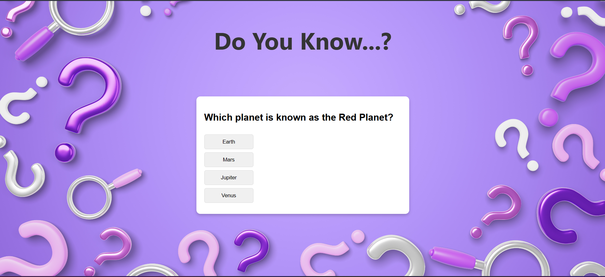
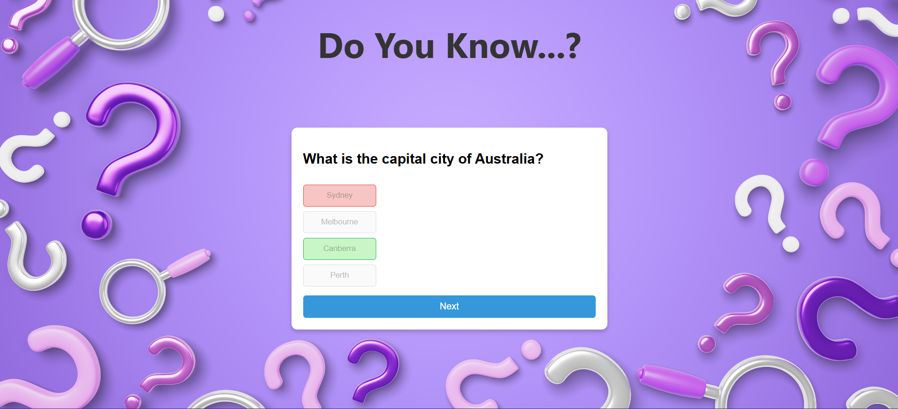
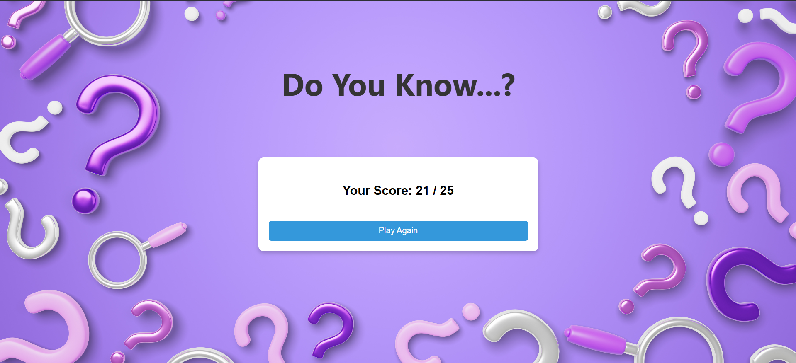

# Interactive Quiz Application

This project is a simple interactive quiz application built with HTML, CSS, and JavaScript. It is designed to challenge users with general knowledge questions and keep track of their scores.

## Features

- Multiple choice questions
- Instant feedback on correct/wrong answers
- Score tracking
- Option to replay the quiz

## Demo

To run the application, simply open `index.html` in your browser.

### Screenshots





## How to use

1. Clone or download this repository:

```
git clone https://github.com/Nehal-Adil/Web-Dev-Cohort.git
```

2. Navigate to:

```
Masterji Projects/01_HTML-CSS/Interactive Quiz Application
```

3. Open `index.html` in your browser.

## Customization

- Add your own questions by modifying `questions.js`.
- Change the look by editing `style.css`.

## Credits

Developed by [Nehal Adil](https://github.com/Nehal-Adil).
