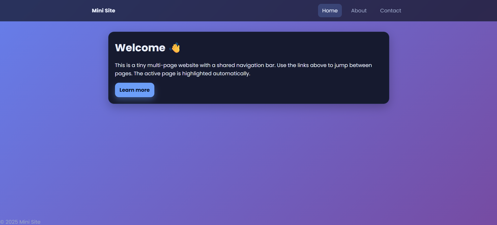
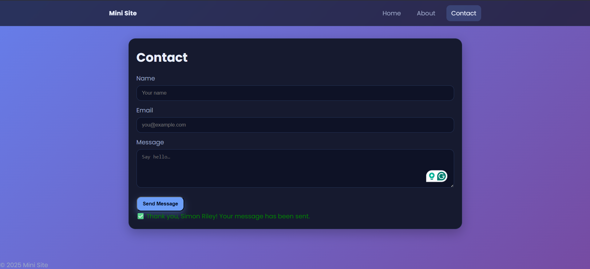

# 🌐 Multi-Page Website

A responsive, multi-page static website built with **HTML5** and **CSS3** as part of the Web Dev Cohort curriculum. This project demonstrates core front-end development skills including semantic markup, responsive design, navigation across pages, and clean UI implementation.

- Home Page



- Contact Form



## 🚀 How to Use

1. **Clone the repository**:

   ```bash
   git clone https://github.com/Nehal-Adil/Web-Dev-Cohort.git
   cd Web-Dev-Cohort/Masterji\ Projects/01_HTML-CSS/Multi-Page\ Website

   ```

2. Open any HTML file directly in your browser:

- index.html → Home page
- about.html → About page
- contact.html → Contact page

3. Navigate between pages using the site’s main menu.

- 💡 No build step or server required — works with simple file opening!

## ⚠️ Important Note on JavaScript

> **JavaScript is used ONLY to prevent the contact form from submitting** (to avoid page reload during demo).  
> There is **no form validation, data handling, or external API integration** — this is a **static frontend project**.  
> The script does **not** collect or send any user data.

## 🔜 Future Enhancements

This project can be extended with modern web techniques such as:

- Page transition animations (using CSS or libraries like Barba.js for smooth cross-page fades)
- Mobile-friendly hamburger menu with JavaScript toggle
- Form validation & submission via Netlify Forms, Formspree, or a backend service
- Dark/light mode toggle with localStorage persistence
- Performance optimization: image lazy loading, critical CSS inlining
- Accessibility improvements: ARIA labels, skip-to-content links
- CSS custom properties (variables) for easier theming
- Convert to single-page app (SPA) using client-side routing for seamless navigation

## Credits

Developed by [Nehal Adil](https://github.com/Nehal-Adil).
