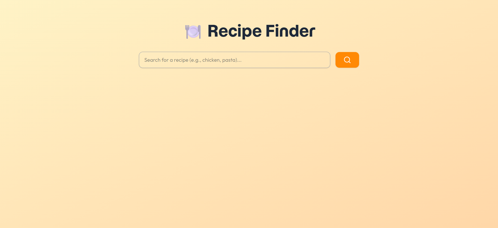
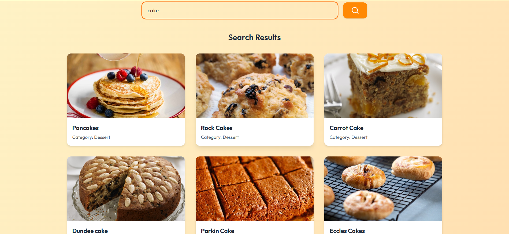
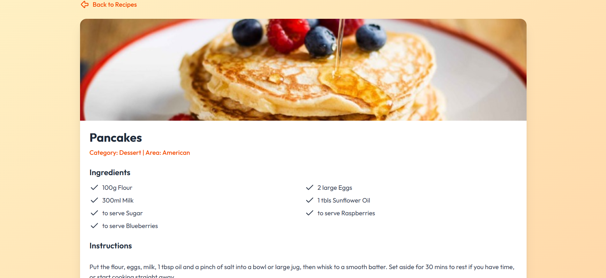

# 🍽️ Recipe Finder Application

A sleek, recipe search application built with **vanilla JavaScript** and **Tailwind CSS**, powered by **TheMealDB API**. Search thousands of recipes, view ingredients, instructions, and even watch cooking tutorials on YouTube!

## ✨ Features

- 🔎 Search recipes by name (e.g., "chicken", "pasta")
- 📋 View full recipe details:
  - Ingredients list (parsed from API)
  - Step-by-step instructions
  - Cuisine category & origin country
  - YouTube tutorial link (if available)
- 🔄 Navigate between search results and recipe details
- ✅ Clean card-based UI using Tailwind CSS

## 🛠️ Tech Stack

- **HTML5** + **CSS3**
- **JavaScript (ES6+)** – async/await, DOM manipulation
- **TheMealDB API** – [https://www.themealdb.com/api.php](https://www.themealdb.com/api.php)
- **Tailwind CSS**
- **Lucide Icons**

### 🌐 API Used

- Search: https://www.themealdb.com/api/json/v1/1/search.php?s={query}

- Lookup: https://www.themealdb.com/api/json/v1/1/lookup.php?i={id}

✅ Free to use — no API key required!

## 🚀 Quick Start

### 1. Download the Project

- Clone the repository:
  ```bash
  git clone https://github.com/Nehal-Adil/Web-Dev-Cohort.git
  ```
- Navigate to the project directory:
  ```bash
  cd Web-Dev-Cohort/Masterji\ Projects/02_JavaScript/Weather\ App\ \ (API\ Integration)
  ```

### 2. Install Dependencies

- Install the dependencies:
  ```bash
  npm install
  ```

### 3. Run the Application

- Run the application:
  ```bash
  npm run dev
  ```
- Open [http://localhost:5173](http://localhost:5173) in your browser.

### Screenshots

- 📸 Home Screen
  

- 📸 Recipes
  

- 📸 Recipe Details
  

## 🔧 Potential Enhancements

- ✅ Make it responsive using Tailwind’s mobile-first breakpoints (sm:, md:, etc.)

- 🌗 Add dark mode toggle with prefers-color-scheme support

- ❤️ Implement favorites using localStorage

- 🔠 Add search debounce to reduce API calls

- 🖨️ Include "Print Recipe" button

- 🔍 Add filter by category (e.g., Veg, Dessert, Seafood)

## Credits

Developed by [Nehal Adil](https://github.com/Nehal-Adil).
