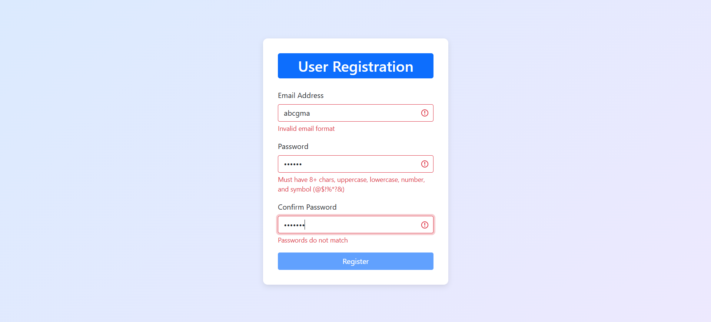
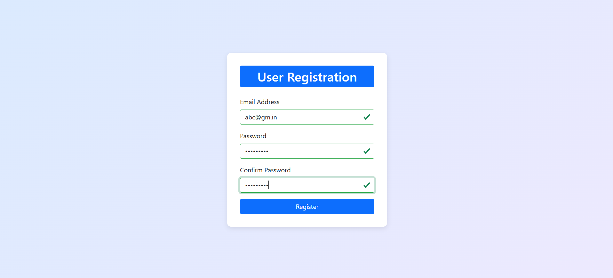

# Form Validation

> A clean, responsive user registration form with real-time validation for **email**, **password**, and **confirm password** fields using HTML, CSS, Bootstrap and vanilla JavaScript.




## 📂 Project Location

`/Masterji Projects/02_JavaScript/Registration Form Validation`

## ✨ Features

- **Real-time validation** as the user types
- **Email format validation** (RFC-compliant)
- **Strong password policy**:
  - At least 8 characters
  - Contains uppercase & lowercase letters
  - Contains at least one number
  - Contains at least one special character (`@$!%*?&`)
- **Password confirmation** match check
- **Visual feedback**:
  - Red border for invalid fields
  - Green border for valid fields
  - Descriptive error messages
- **Submit button disabled** until all fields are valid

## 🚀 Getting Started

1. Clone the repository:

   ```bash
   git clone https://github.com/Nehal-Adil/Web-Dev-Cohort.git
   cd Web-Dev-Cohort/Masterji\ Projects/02_JavaScript/Registration\ Form\ Validation

   ```

2. Open index.html in your browser (or serve via a static server for local testing).

## Potential Enhancements

- Add password visibility toggle (show/hide password with eye icon)

- Implement password strength meter (visual indicator: weak/medium/strong)

- Add "Remember me" checkbox for login forms

- Add real-time username/email availability check (via API)

- Add loading spinner during form submission

- Implement success/error toast notifications

- Add debounce to validation (avoid excessive checks on every keystroke)

- Support social login (Google, Facebook, Apple)

## Credits

Developed by [Nehal Adil](https://github.com/Nehal-Adil).
