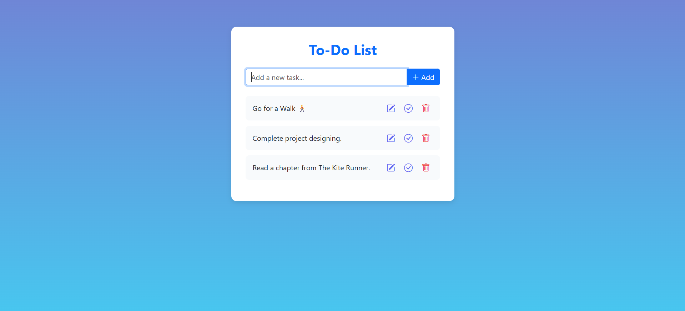
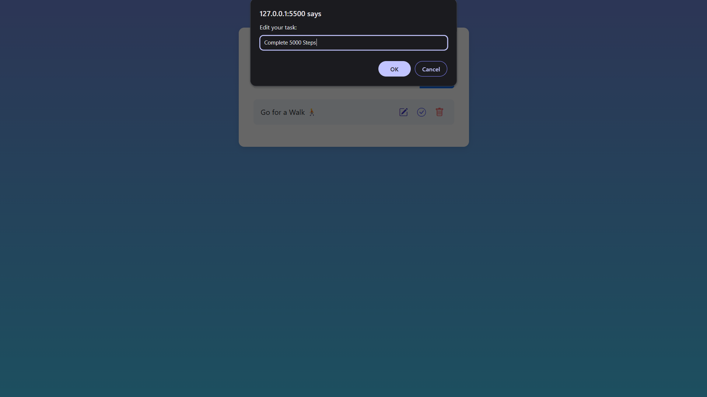

# 📝 To-Do List App

A simple and elegant **To-Do List App** built using **HTML, Bootstrap 5, and Vanilla JavaScript**.  
This app allows users to **add, edit, delete, and mark tasks as complete**, while automatically saving progress to the **browser's localStorage**.

### Preview

- Home Page
  
- Edit Tasks
  

---

## 🚀 Features

- ✍️ **Add new tasks**
- 🖊 **Edit existing tasks**
- ✅ **Mark tasks as complete or incomplete**
- ❌ **Delete tasks**
- 💾 **Auto-saves tasks** using browser localStorage
- 📱 **Responsive design** powered by Bootstrap 5
- 🌈 Clean and modern UI with subtle gradient background

---

## 🧠 Tech Stack

- **HTML5** – structure
- **Bootstrap 5** – styling and layout
- **JavaScript (ES6)** – app logic and interactivity
- **Bootstrap Icons** – icons for edit, delete, and add

---

## 📦 Installation & Usage

1. Clone or download this repository.
   ```bash
   git clone https://github.com/Nehal-Adil/Web-Dev-Cohort.git
   cd Web-Dev-Cohort/Masterji\ Projects/02_JavaScript/TodoApp
   ```
2. Open index.html in your browser — no setup required!

---

## 💡 Future Enhancements

- ✨ Inline editing instead of prompt dialogs

- 📅 Add due dates for tasks

- 🔍 Search and filter tasks

- 🕒 Task reminders or notifications

- 🖋️ Count of total tasks and completed tasks

## Credits

Developed by [Nehal Adil](https://github.com/Nehal-Adil).
