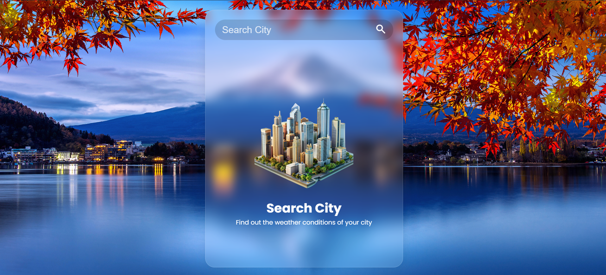
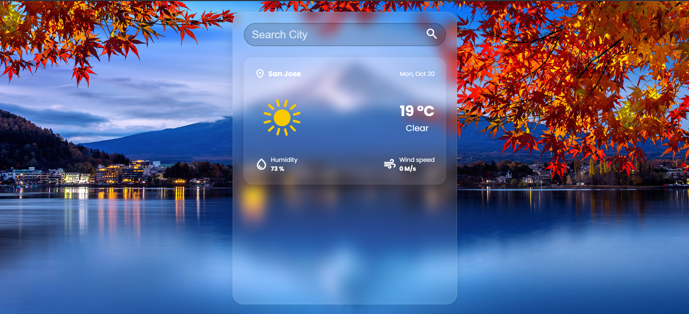
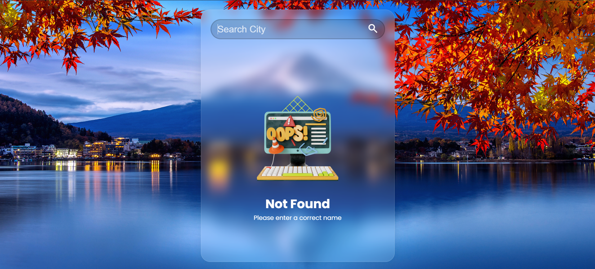

# 🌤️ Weather App (API Integration)

A sleek, modern weather application built with **HTML, CSS, and JavaScript** that fetches real-time weather data using the **OpenWeatherMap API**, built as part of the Web-Dev-Cohort “Masterji Projects”. Features a stunning **glassmorphism UI** with responsive design for all devices.

## ✨ Features

- **Real-time weather data**: Current temperature, conditions, humidity, and wind speed
- **Search by city**: Instantly get weather for any location worldwide
- **Modern UI**: Dark-mode glassmorphism design with smooth animations
- **Fully responsive**: Works on mobile, tablet, and desktop
- **Error handling**: Graceful messages for invalid cities or network issues

## 🛠️ Tech Stack

- **HTML5** & **CSS3** (Flexbox, Grid, Glassmorphism)
- **JavaScript** (ES6+, Fetch API, DOM manipulation)
- **OpenWeatherMap API** (Free tier)

## 🚀 Quick Start

### 1. Get Your API Key

> ⚠️ **Important**: The API key in this repository is **not valid**.  
> **You must get your own free API key** from [OpenWeatherMap](https://openweathermap.org/api):
>
> 1. Go to [OpenWeatherMap Sign Up](https://home.openweathermap.org/users/sign_up)
> 2. Verify your email and log in
> 3. Navigate to **API Keys** section
> 4. Copy your default key (or create a new one)

### 2. Configure the Project

1. Clone this repository:
   ```bash
    git clone https://github.com/Nehal-Adil/Web-Dev-Cohort.git
    cd Web-Dev-Cohort/Masterji\ Projects/02_JavaScript/Weather\ App\ \ (API\ Integration)
   ```
2. Add your API key in script.js (or your main JS file):
   ```Javascript
   // Replace 'YOUR_API_KEY_HERE' with your actual OpenWeatherMap API key
   const API_KEY = 'YOUR_API_KEY_HERE';
   const API_URL = `https://api.openweathermap.org/data/2.5/weather?appid=${API_KEY}&units=metric`;
   ```
3. Open the index.html file in your browser (or run a local server if preferred).

### Screenshots





## 🔧 Potential Enhancements

- Automatically detect user’s location via Geolocation API.

- Add a toggle for Celsius / Fahrenheit.

- Use weather icons or background images based on weather conditions.

- Persist last searched city in localStorage and load it on next visit.

- Extend to 5-day or hourly forecast.

- Add responsiveness and CSS animations for better UX.

## Credits

Developed by [Nehal Adil](https://github.com/Nehal-Adil).
